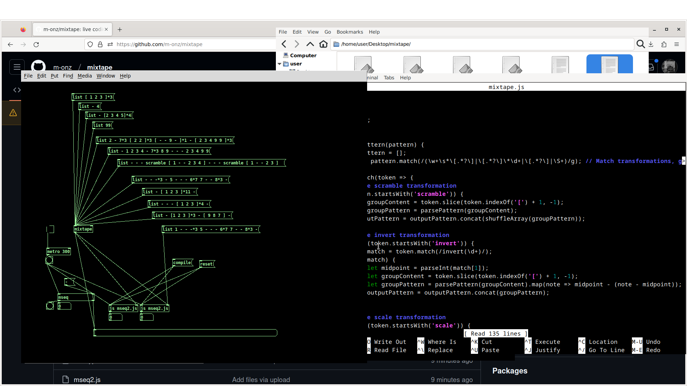

# mixtape

## Screenshot



## Overview

A live coding toolkit for algorithmic music and visual composition in Pure data (Pd) and GEM. 

## Install

Add the "mixtape/lib" folder to the Pd path:

file -> preferences -> edit preferences -> new (add a new path).

## Status

More objects and examples being adding, the parser is currently a bit buggy but it will eventually allow for complex patterns.

## What is a mixtape?

mixtape is an approach to algorithmic music or visual composition based on the concept of messages (or tapes) that can be fed into sequencing objects.

The concept is incredibly simple, tapes are simply messages that contain hyphens (rests) and numbers. 

```
- - 1 2 3 4 - - 4
```

This becomes a list/message that can be fed into else/sequencer or mseq (basically a sequencing object that iterates through the message).

mixtape allows you to create more complex patterns and outputs a list of either rests or numbers. eg.

```
- 1 2 4*3 [ 1 2 ]*3 scramble [ 1 2 - 3 4 ]  
```

numbers can be used as MIDI numbers, parameters or just numbers for any purpose.

## Comparison to tidalcycles mini notation

This object has no opinions on where you feed the "tape" message into and because its only concerned with a single instrument so there is no need to reference multiple instruments or worry about high level orchestration or control. It's incredibly simple (by design) and surprising powerful and flexible for algorithmic composition.

## Dependencies

It relies on `pdjs` that can be installed easily via dekken.

